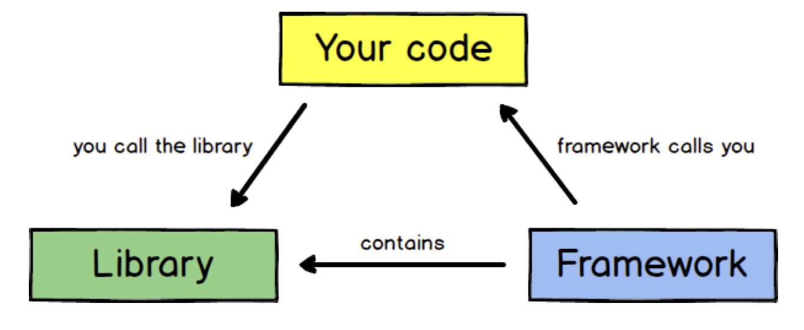

# Introduction to Express JS 💻


- In summary, express is a **minimal and unopinionated web framework** for Node.
- Express **handles low level functionality of the Node web server** so that you can focus on the business logic of your app.
- Express provides **only a thin layer of abstraction over vanilla Node** `http` server features. If required you can even add vanilla `http` code and it will be compatible with an Express app.


### Library vs framework
- A library is essentially a set of **functions that you can call**. The key idea behind libraries is code reuse: someone writes a bundle of code that is generally useful and can be shared across applications, so that other developers don't have to write it from scratch each time. Examples: jQuery, Underscore, Ramda, Lodash, Moment. Many of the npm modules can be thought of as libraries, e.g. the Request module.
- A framework embodies some abstract design, with more behaviour built in. In order to use it you need to insert your behaviour into various places in the framework. The **framework's code then calls your code** at these points. Examples: Angular, Express, Hapi, Koa.
- The key difference between a library and a framework is that with the library, you are in control. With the framework, the control is inverted: the framework calls you ('the Hollywood principle'): "Don't call us, we'll call you".



### Opinionated vs unopinionated
- **Opinionated** frameworks are those with opinions about the **"right way"** to handle any particular task.
- **Unopinionated** frameworks, by contrast, have **far fewer restrictions** on the best way to glue components together to achieve a goal, or even what components should be used. They make it easier for developers to use the optimal modules to complete a particular task, however at the cost that **you need to find the modules yourself**.
- **Express is unopinionated**. You can insert almost any compatible middleware you like into the request handling chain, in almost any order you like. You can structure the app in one file or multiple files, and using any directory structure. You may sometimes feel that you have too many choices!


### Abstraction
- Abstraction is a manner in which a person interacts with a program or system without directly working with more complex details "under the hood". Complex details that may not be of interest are abstracted away so that the programmer works with only what is necessary to complete the task.
- Libraries and frameworks are built on the idea of abstraction: they both abstract the underlying code.


### Express vs Node http module
- Express is a framework and not a "module". Express gives you an API, submodules, and methodology and conventions for quickly and easily tying together all the components necessary to set up a functional web server with all the conveniences necessary (static asset hosting, templating, CORS, cookie parsing, POST parsing etc.)
- For example, you can serve a whole directory of static files (images, CSS, JavaScript etc.) from your node server with a single line of code
```js
app.use(express.static('public'));
```
instead of writing long and bespoke functions for your vanilla `http` app: https://github.com/foundersandcoders/Node-Intro-Workshop/blob/completed-workshop/src/handlers/handlers.js#L6-L27


### Express hello world
```js
const express = require('express');

const app = express();

app.get('/', (req, res) => {
  res.send('Hello world');
});

app.listen(3000, () => {
  console.log('App running on port 3000');
});
```
First we require() the express module and create an Express application. This object, which is traditionally named app, has methods for routing HTTP requests, configuring middleware, rendering HTML views, registering a template engine, and modifying application settings that control how the application behaves (e.g. the environment mode, whether route definitions are case sensitive, etc.)

The middle part of the code (the three lines starting with `app.get`) shows a route definition. The app.get() method specifies a callback function that will be invoked whenever there is an HTTP GET request with a path (`'/'`) relative to the site root. The callback function takes a request and a response object as arguments, and simply calls send() on the response to return the string `'Hello world'`.

The final block starts up the server on port `3000` and prints a log comment to the console. With the server running, you could go to localhost:3000 in your browser to see the example response returned.
